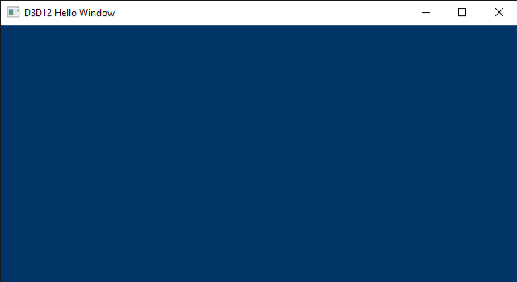
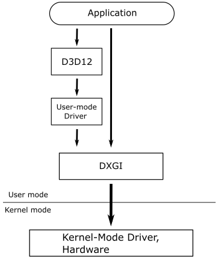
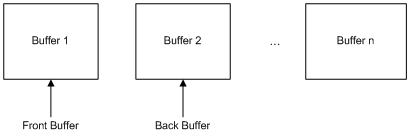

# Hello Window



## Introduction
DirectX provides a set of APIs that can be used to create games and graphics applications. Specifically, it includes support for high-performance 2-D and 3-D graphics, audio, arithmetic, and linear algebra operations. Below is a list of the main APIs included in DirectX. However, our primary focus is on Direct3D 12 and DirectXMath, the only ones we will be using for a while.

<br>

**Direct3D** provides functionality for performing 3-D graphics rendering tasks. It is used to draw primitives (i.e., points, lines, and triangles) within the rendering pipeline or to start parallel operations on the GPU. When we refer to Direct3D 12, we are specifically talking about the API that enables apps to leverage the graphics and computing capabilities of PCs equipped with a DirectX 12-compatible GPU.

**Direct2D** offers functionality for rendering 2-D geometries, bitmaps, and text. It is designed to interoperate with existing code that uses Direct3D to create 2D menus, user interface (UI) elements, and Heads-up Displays (HUDs).

**DirectWrite** provides support for high-quality text rendering, resolution-independent outline fonts, and full Unicode text and layouts. It is designed to interoperate with Direct2D to render text by taking advantage of hardware acceleration. Text can also be filled with an arbitrary Direct2D brush, such as radial gradients, linear gradients, and bitmaps.

**DirectXMath** provides types and helper functions for common linear algebra and graphics math operations that are frequently used in DirectX applications.

**XAudio2** allows the addition of sound effects and background music, or the development of high-performance audio engines.

**XInput** enables applications to receive input from the Xbox Controller when it is connected to a Windows PC.

<br>

To create graphics applications, you first need a window to draw on. Therefore, the aim of this tutorial is to create and display a simple window on your screen. For this purpose, we will examine the [D3D12HelloWindow](https://github.com/microsoft/DirectX-Graphics-Samples/tree/master/Samples/Desktop/D3D12HelloWorld) sample, which is part of the [DirectX-Graphics-Samples](https://github.com/microsoft/DirectX-Graphics-Samples) repository maintained by Microsoft. The only significant graphics operation performed by this sample is the setting of the window background color. You might be surprised to discover that you need to write a substantial amount of code to execute this simple operation. The good news is that the code we will review in this first tutorial primarily consists of boilerplate code. This means that, by the end of this tutorial, you will have a basic understanding of the common framework used by almost all samples we will examine in the upcoming tutorials, so we can solely focus on new additions.

Before starting to review the source code of the [D3D12HelloWindow](https://github.com/microsoft/DirectX-Graphics-Samples/tree/master/Samples/Desktop/D3D12HelloWorld) sample, you need a basic understanding of the Component Object Model (COM), the DXGI API, as well as how Windows applications work. You can skip the following three sections if you are comfortable with these topics. Alternatively, you can also refer to {cite}`AboutWindows,ProgrammingDirectXWithCOM,DXGIOverview` for further information.

<br>

## Windows applications
This section is heavily inspired by the first chapter of the book “Programming Microsoft Visual C++, Fifth Edition” by David J. Kruglinski, George Shepherd and Scott Wingo.

Windows applications use an event-driven programming model, as illustrated in the following below. In this model, programs respond to events by processing messages sent by the operating system. An event could be a keystroke, a mouse click, or a command for a window to repaint itself. The entry point of a Windows application is a function called **WinMain**, but most of the action occurs in a function known as the window procedure. The window procedure processes messages sent by the OS to the application that a window belongs to. **WinMain** creates that window and then enters a message loop, retrieving messages and dispatching them to the window procedure. Messages wait in a message queue until they are retrieved. The primary task of a Windows application is to respond to the messages it receives. In between messages, it does little except wait for the next message to arrive. An application can exit the message loop when a **WM_QUIT** message is retrieved from the message queue, signaling that the application is about to end. This message is sent by the OS when the user closes the window. When the message loop ends, **WinMain** returns, and the application terminates.

<br>


<br>

```{note}
Window messages can also be sent directly to a window procedure, bypassing the message queue. If the sending thread is dispatching a message to a window created by the same thread, the window procedure of the specified window is invoked. However, if a thread is dispatching a message to a window created by a different thread, the process becomes more complex. Fortunately, we don't need to delve into the low-level details in this tutorial series.
```

### Window Procedure

As previously mentioned, a window procedure is a function that receives and processes messages sent by the operating system to the application that a window belongs to. A window class defines key characteristics of a window, such as its window procedure address, its default background color, and its icon. Every window created with a specific class will use the same window procedure to respond to messages.

When the application dispatches a message to a window procedure, it also passes additional information about the message as arguments in its input parameters. This allows the window procedure to perform an appropriate action for a message by consuming the related message data. If a window procedure does not process a message, it must return the message to the system for default processing by calling the **DefWindowProc** function, which performs a default action and returns a message result. The window procedure must then return this value as its own message result.

Since a window procedure is shared by all windows belonging to the same class, it can process messages for different windows. To identify the specific window a message is addressed to, a window procedure can examine the window handle passed as an input parameter. The code provided in the window procedure to process a particular message is known as a message handler.


### Messages

Windows defines many different message types. Usually, messages have names that begin with the letters "WM_", as in **WM_CREATE** and **WM_PAINT**. The following table shows ten of the most common messages.

<br>

| Message        | Sent when                                                                      |
| -------------- | ------------------------------------------------------------------------------ |
| WM_CHAR        | A character is input from the keyboard.                                        |
| WM_COMMAND     | The user selects a menu item, or a control sends a notification to its parent. |
| WM_CREATE      | A window is created.                                                           |
| WM_DESTROY     | A window is destroyed.                                                         |
| WM_LBUTTONDOWN | The left mouse button is pressed.                                              |
| WM_LBUTTONUP   | The left mouse button is released.                                             |
| WM_MOUSEMOVE   | The mouse pointer is moved.                                                    |
| WM_PAINT       | A window needs repainting.                                                     |
| WM_QUIT        | The application is about to terminate.                                         |
| WM_SIZE        | A window is resized.                                                           |

<br>

For example, a window receives a **WM_PAINT** message when its interior needs repainting. You can think of a Windows program as a collection of message handlers.

When the message loop dispatches a message, the window procedure is called, and you can retrieve the information on the message from its four input parameters:

* The handle of the window to which the message is directed,

* A message ID, and

* Two 32-bit parameters known as **wParam** and **lParam**.

<br>

The window handle is a 32-bit value that uniquely identifies a window. Internally, the value references a data structure in which the OS stores relevant information about the window such as its size, style, and location on the screen.

The message ID is a numeric value that identifies the message type: **WM_CREATE**, **WM_PAINT**, and so on.

**wParam** and **lParam** contain information specific to the message type. For example, when a **WM_LBUTTONDOWN** message arrives, **wParam** holds a series of bit flags identifying the state of the <kbd>Ctrl</kbd> and <kbd>Shift</kbd> keys and of the mouse buttons. **lParam** holds two 16-bit values identifying the location of the mouse pointer (in screen coordinates) when the click occurred. At that point, you have all you need to know to process the **WM_LBUTTONDOWN** message in the window procedure. Conventionally, **WinMain** should return the value stored in the **wParam** of the **WM_QUIT** message.

The only criticism to the above explanation is that, unlike typical window applications, graphics applications perform the majority of their processing in between messages. However, the [D3D12HelloWindow](https://github.com/microsoft/DirectX-Graphics-Samples/tree/master/Samples/Desktop/D3D12HelloWorld) sample is an exception as its sole purpose is to display a window on the screen (i.e., no significant graphics operations are involved).

<br>

## Component Object Model (COM)

Microsoft used the Component Object Model (COM) to design the internals of DirectX. Therefore, whenever you program with DirectX, you are also implicitly using COM. This is an object-oriented programming model created by Microsoft to break dependencies of the code at the binary level. This implies that if an API, a framework, or a generic technology is built upon COM, then it will be language-independent and backward-compatible, to a certain extent.

```{note}
Unfortunately, this doesn't automatically mean you can write DirectX applications using any programming language you want, or that you can run a DX12 application with older libraries and runtime (DX11 or earlier).
```

COM is a complex programming model, but fortunately, you don't need to master it to write DirectX applications. Indeed, we will only use COM as end-users rather than for developing our API or framework. That is, DirectX will hide the complexity of COM from us. However, to effectively program with DirectX, we still need to know some basic concepts about COM. First, it can be useful to understand what it means to break dependencies of the code at the binary level and what type of problems this break can solve.

If you've ever developed a Windows library, you're likely familiar with the process of exporting functionality from DLLs written in the C language for use by applications written in other languages (such as C++, C#, Java, Python, etc.). Microsoft didn't use C to write DirectX, though. They preferred an object-oriented language like C++. Now, consider the scenario of writing a DLL that exports a C++ class. The functionality provided by this class can't be easily used by other languages because C++ only specifies what happens at the source code level. The standard doesn't say anything about what happens at the binary level. For example, we know that object-oriented languages use virtual tables to implement polymorphism. However, this is an implementation concept, just like the stack and the heap: the C++ standard doesn't say anything about how to implement polymorphism. The following image shows a common layout for a class in memory. However, nothing prevents a new language from placing the virtual table pointer at the end, or defining a whole new system to implement polymorphism.

<br>


<br>

In other words, using a C++ class exported from a DLL is feasible as long as you are operating on the same OS and with the same compiler. Conversely, other languages or different implementations of C++ might struggle to communicate with the DLL if they lack knowledge about the binary layout of the exported class in memory. Specifically, when a compiler attempts to resolve a call to a virtual function, it requires knowledge of the class's memory layout to access the function in the virtual table.

Even if you were able to use a C++ class exported from a DLL, one problem still remains. Typically, the DLL developer provides an include file with the class declaration. Now, consider using this include file to compile an application that creates an instance of the exported class as a local variable on the stack. Additionally, assume you place the DLL in the executable directory of your application. Also, suppose that you put the DLL in the executable directory of your application. After a while, the developer releases an updated version of their DLL, and you choose to overwrite the old one in the executable directory without recompiling your app as the notes of the developer indicate they only added a private member in the exported class. Indeed, C++ rules state that everything should be fine as the public part has not changed. The problem is that this statement is only valid at the source level, not at the binary level. If you now execute your app, the new DLL is loaded in memory and the new constructor of the exported class is invoked to initialize the new private member. However, you haven't recompiled your app, so the space reserved for the local variable on the stack is the one specified by the definition of the class in the old include file you used to compile the first time. You can easily imagine how this can lead to incorrect results, or even worse, crashes.

These problems arise from the fact that the binary representation of the DLL is exposed to the app. COM try to resolve this inconvenience with few fundamental principles:

* Clients (apps) communicate with servers (DLLs) using abstract interfaces instead of concrete classes. If a server exports a class (called COM class) that implements an interface, a client can reference an instance of the COM class (called COM object) through an interface pointer and use it to call the member methods exported by the COM class.

* Clients create COM objects using methods implemented in the servers. That way, the implementation of the COM class is hidden from the clients entirely. Only the server knows how to create a COM object, so if the private part of the COM class changes, the client is not affected because the interface is still the same — interfaces don't contain data members.

* COM classes and interfaces have unique IDs. That way it's possible for more than a server to implement the same interface, and for a client to load the correct server (DLL) in memory. So, if there are more versions of the DLL available, the client can choose what server to load. Then, if your application wants to use new functionalities, you are forced to recompile.

<br>

However, even though COM involves the use of abstract interfaces, client and server still need to agree on the binary representation of these interfaces for effective communication. To address this, the COM specification outlines a binary object layout that can be implemented and comprehended by nearly any language and platform. Notably, Microsoft opted to employ a virtual table mechanism similar to the one used in their C++ implementation. Essentially, a COM interface in memory is nothing more than a virtual table containing function pointers and additional data. Consequently, an interface pointer to a COM object is merely a pointer to a virtual table.

In essence, for a language or compiler to support COM, it must adhere to the layout of COM interfaces as specified by the COM specification. This requirement highlights one of the reasons why you may not always be able to use DirectX with your preferred programming language.

As mentioned earlier, clients cannot directly create COM objects. Typically, we use a method like **CoCreateInstance**, specifying the COM class ID for which the client wants to create a COM object, and the interface ID implemented by the COM class that the client is interested in obtaining a pointer to. The client doesn't need to know where the server is located. The Windows Registry is used for this purpose, and **CoCreateInstance** (with the help of a system service) can locate the server based on the arguments passed as parameters. At this point, the server can create the COM object, and an interface pointer to that object is returned to the client, which can use it to communicate with the server (i.e., call its member functions).

However, you would rarely use **CoCreateInstance** to directly create DirectX COM objects. Typically, we will create COM objects indirectly by using specific DirectX methods that return pointers (as output parameters) to whatever interface is implemented by the related COM classes. Although this mechanism is less centralized (i.e., it doesn't rely on the Windows Registry to locate servers), it functions similarly. Generally, the functions to create DirectX COM objects return an **HRESULT**, an encoded value indicating the success or failure of the operation.

At this point we can better define the meaning of backward compatibility mentioned at the beginning of this section. In short, a DirectX application can run on a system provided that the servers with the COM classes used by the client can be loaded. So, as long as new versions of a DLL don't change the COM classes to include new disruptive functionalities that modify the related COM interfaces, the application can still load the new DLL and use the new COM classes without problems.

before creating any COM object, you should initialize the COM library by calling **CoInitializeEx**. However, when you create COM objects indirectly, the creation methods will handle this task for you. We will see many examples of such methods in the upcoming tutorials.

COM defines a base interface that all other interfaces must extend: **IUnknown**. This interface defines some basic operations:

* **AddRef** increments the reference count for an interface pointer to a COM object. You should call this method whenever you make a copy of an interface pointer.

* **Release** decrements the reference count for an interface on a COM object. When the reference count on an object reaches zero, this method must cause the interface pointer to free itself.

* **QueryInterface** queries a COM object for a pointer to one of its interfaces; identifying the interface by a reference to its interface identifier (IID). If the COM object implements the interface, then it returns a pointer to that interface after calling **AddRef** on it.

<br>

Directly managing interface pointers to COM objects can be a challenging task, as you need to explicitly call **Release** and **AddRef** to maintain the reference count. A more convenient solution with C++ is to use smart pointers. **Microsoft::WRL::ComPtr** is a smart pointer provided by the Windows Runtime C++ Template Library (WRL). This library is "pure" C++, making it suitable for classic Win32 desktop applications. It automatically calls **AddRef** and **Release** on the underlying interface pointer, meaning it maintains a reference count for the underlying interface pointer and releases the interface pointer when the reference count drops to zero. Moreover, it defines various other methods, including:

* **Get** returns the underlying interface pointer to a COM object. It's especially useful when you have functions that accept a raw interface pointer instead of a **ComPtr**.

* **GetAddressOf** returns a pointer to the underlying interface pointer to a COM object. It's especially useful because, whenever you create a COM object indirectly, the default is to return the interface pointer as an output parameter (i.e., as a pointer to an interface pointer).

* **Reset** calls **Release** on the underlying interface pointer to a COM object and then set it to **nullptr**. It can be useful when you don't need the underlying interface pointer anymore, but the **ComPtr** hasn't gone out of scope yet.

* **ReleaseAndGetAddressOf** is similar to **Reset** but it returns the underlying pointer (that will be a **nullptr**) to the caller. It can be useful if you want a new initialization for an underlying interface pointer you don't need anymore (e.g., when you want to pass it as an argument to the output parameter of a creation method).

* **Detach** returns the underlying interface pointer to a COM object and then set it to **nullptr**. It can be useful if you need to return the underlying interface pointer to a caller and, at the same time, you don't need the local **ComPtr** object anymore.

* **As** is just a wrapper around **QueryInterface**. It takes another **ComPtr** as input parameter to get a pointer to one of the interfaces implemented by a COM object.

<br>

Also, the dereference operator -> is overloaded and returns the underlying interface pointer to a COM object, so that you don't need to call **Get** if you only want to invoke a function through the interface pointer.

<br>

## DirectX Graphics Infrastructure (DXGI)

Microsoft DirectX Graphics Infrastructure (DXGI) is an API that collects functionality and tasks that don't change regardless of the version of graphics API you are actually using (Direct3D 10, 11, or 12). Specifically, DXGI manages low-level tasks such as enumerating hardware graphics devices (GPUs) and outputs (monitors), creating rendering buffers, presenting rendered frames to an output, controlling gamma, and managing full-screen transitions. This allows a graphics API to focus on drawing 3D content into buffers without worrying about the origin of these buffers or how they will be displayed. <br>
DXGI's purpose is to communicate with the kernel mode driver and the system hardware, as shown in the following diagram.

<br>



<br>

A graphics application can either access DXGI directly or use the Direct3D API, which manages communications with DXGI. You might prefer to interact with DXGI directly if your application needs to enumerate devices or control how data is presented to an output.

An adapter is an abstraction of a hardware or software device. Typically, there are multiple adapters on a machine. Some devices are implemented in hardware, such as a video card, while others are implemented in software, like the Direct3D rasterizer provided by Microsoft. The following diagram illustrates a system with a single computer, two adapters (video cards), and three output monitors.

<br>


<br>

The primary task of your graphics applications is to draw on buffers and ask DXGI to present those buffers as frames to the output. If the application has two buffers available, it can render on one buffer (the render target) while presenting another one. Depending on the time it takes to render a frame, or the desired frame rate for presentation, the application may need more than two buffers. The collection of buffers created is referred to as a swap chain, as depicted in the following illustration.

<br>



<br>

A swap chain consists of one front (or present) buffer and one or more back buffers, which are used as render targets. Each application creates its own swap chain. To maximize the speed of data presentation to an output, a swap chain is almost always created in GPU memory. DXGI, with the assistance of the kernel driver, is responsible for scanning rendered content in the front buffer from video memory and presenting it on outputs.

A swap chain can be configured for drawing in either full-screen or windowed mode, eliminating the need to determine whether an output is windowed or full screen. A full-screen mode swap chain can optimize performance by switching the display resolution. An output can support one or more display modes, which include resolution, refresh rate, format, etc. DXGI might change the display mode of an output when making a full-screen transition. However, resizing swap chain buffers will not trigger a display mode switch. The swap chain makes an implicit promise that if you choose a back buffer that exactly matches a display mode supported by the target output, then it will switch to that display mode when entering full-screen mode on that output. Consequently, you actually select a display mode by choosing your back buffer size and format.

<br>

## Framework overview

As mentioned earlier in this tutorial, the framework used for building the [D3D12HelloWindow](https://github.com/microsoft/DirectX-Graphics-Samples/tree/master/Samples/Desktop/D3D12HelloWorld) sample is common to nearly all the other samples we'll explore in the upcoming tutorials. This means that, by the end of this tutorial, you will know how to write a generic DirectX application, or at least the backbone of a complete graphics application.

As you can see in {numref}`project-props` below, the Direct3D 12 and DXGI import libraries (LIB files) are listed in the additional dependencies of the project. The information stored in these files will help the linker resolve references to functions exported by the corresponding DLLs. Also, observe that the Direct3D 12 DLL will not be loaded when the application starts, but only the first time we call an exported function. This approach improves performance by only loading DLLs when they're needed, which can reduce startup time and improve memory usage.

<br>

```{figure} images/A/project-properties.PNG
---
name: project-props
---
Project property pages in Visual Studio
```
<br>

DirectX applications are normal Windows programs, so the entry point is **WinMain** as usual.

```{code-block} cpp
:caption: WinMain
:name: winmain-code
#include "stdafx.h"
#include "D3D12HelloWindow.h"
 
_Use_decl_annotations_
int WINAPI WinMain(HINSTANCE hInstance, HINSTANCE, LPSTR, int nCmdShow)
{
    D3D12HelloWindow sample(1280, 720, L"D3D12 Hello Window");
    return Win32Application::Run(&sample, hInstance, nCmdShow);
}
```
<br>

{numref}`stdafx-code` show the *stdafx.h* header, which includes other header files associated with various DirectX libraries, such as Direct3D 12, DirectXMath, and DXGI. We need to include *wrl.h* to use the smart pointers provided by the Windows Template Library. *d3dx12.h* defines helpful structures that act as C++ wrappers around Direct3D 12 native structures, simplifying their initialization. Additionally, this header provides helper functions that make handling subresources more straightforward. *D3DCompiler.h* is the header associated with a library we will use to compile shader code. The concepts of subresources and shader code will be covered in upcoming tutorials.

```{seealso}
**_Use_decl_annotations_** is a macro that simplifies SAL annotations. We won't go into detail about this concept, as it's not relevant for this tutorial or the rest of the series. If you want to learn more, check out the official Microsoft documentation: see {cite}`UsingSALAnnotations`.
```
<br>

```{code-block} cpp
:caption: stdafx.h
:name: stdafx-code
#include <windows.h>
 
#include <d3d12.h>
#include <dxgi1_6.h>
#include <D3Dcompiler.h>
#include <DirectXMath.h>
#include "d3dx12.h"
 
#include <string>
#include <wrl.h>
#include <shellapi.h>
```
<br>

**WinMain** is called by the C/C++ runtime startup and takes four parameters. However, we are only interested in the named ones in {numref}`winmain-code`. <br>
**hInstance** represents the base virtual address of the executable file loaded into memory. This information is primarily used by the operating system to identify the application and manage some of its resources. <br>
**nCmdShow** is a flag that indicates whether the main application window is minimized, maximized, or shown normally. We'll pass this flag to a Windows function that's responsible for showing windows (we'll discuss this in more detail in the next section).

<br>

The **D3D12HelloWindow** class is the application class, which defines data and methods specific to the sample.

```{code-block} cpp
:caption: D3D12HelloWindow class
:name: D3D12HelloWindow-code
class D3D12HelloWindow : public DXSample
{
public:
    D3D12HelloWindow(UINT width, UINT height, std::wstring name);
 
    virtual void OnInit();
    virtual void OnUpdate();
    virtual void OnRender();
    virtual void OnDestroy();
 
private:
    static const UINT FrameCount = 2;
 
    // Pipeline objects.
    ComPtr<IDXGISwapChain3> m_swapChain;
    ComPtr<ID3D12Device> m_device;
    ComPtr<ID3D12Resource> m_renderTargets[FrameCount];
    ComPtr<ID3D12CommandAllocator> m_commandAllocator;
    ComPtr<ID3D12CommandQueue> m_commandQueue;
    ComPtr<ID3D12DescriptorHeap> m_rtvHeap;
    ComPtr<ID3D12PipelineState> m_pipelineState;
    ComPtr<ID3D12GraphicsCommandList> m_commandList;
    UINT m_rtvDescriptorSize;
 
    // Synchronization objects.
    UINT m_frameIndex;
    HANDLE m_fenceEvent;
    ComPtr<ID3D12Fence> m_fence;
    UINT64 m_fenceValue;
 
    void LoadPipeline();
    void LoadAssets();
    void PopulateCommandList();
    void WaitForPreviousFrame();
};
```
<br>

The **DXSample** base class defines data and methods used by all graphics samples.

```{code-block} cpp
:caption: DXSample class
:name: DXSample-code
class DXSample
{
public:
    DXSample(UINT width, UINT height, std::wstring name);
    virtual ~DXSample();
 
    virtual void OnInit() = 0;
    virtual void OnUpdate() = 0;
    virtual void OnRender() = 0;
    virtual void OnDestroy() = 0;
 
    // Samples override the event handlers to handle specific messages.
    virtual void OnKeyDown(UINT8 /*key*/)   {}
    virtual void OnKeyUp(UINT8 /*key*/)     {}
 
    // Accessors.
    UINT GetWidth() const           { return m_width; }
    UINT GetHeight() const          { return m_height; }
    const WCHAR* GetTitle() const   { return m_title.c_str(); }
 
    void ParseCommandLineArgs(_In_reads_(argc) WCHAR* argv[], int argc);
 
protected:
    std::wstring GetAssetFullPath(LPCWSTR assetName);
 
    void GetHardwareAdapter(
        _In_ IDXGIFactory1* pFactory,
        _Outptr_result_maybenull_ IDXGIAdapter1** ppAdapter,
        bool requestHighPerformanceAdapter = false);
 
    void SetCustomWindowText(LPCWSTR text);
 
    // Viewport dimensions.
    UINT m_width;
    UINT m_height;
    float m_aspectRatio;
 
    // Adapter info.
    bool m_useWarpDevice;
 
private:
    // Root assets path.
    std::wstring m_assetsPath;
 
    // Window title.
    std::wstring m_title;
};
```
<br>

The **Win32Application** class defines data and methods used by all Windows applications.

```{code-block} cpp
:caption: Win32Application class
:name: Win32Application-code
class Win32Application
{
public:
    static int Run(DXSample* pSample, HINSTANCE hInstance, int nCmdShow);
    static HWND GetHwnd() { return m_hwnd; }
 
protected:
    static LRESULT CALLBACK WindowProc(HWND hWnd, UINT message, WPARAM wParam, LPARAM lParam);
 
private:
    static HWND m_hwnd;
};
```
<br>

```{note}
It's perfectly fine if you don't understand the meaning of every single class member at this point. The important thing is to focus on comprehending the overall structure and purpose of the classes. In the next section and in later tutorials, I will provide more detailed explanations for each of the class members.
```
<br>

As you might have noticed in {numref}`winmain-code`, the entry point (**WinMain**) creates an instance of the **D3D12HelloWindow** class by calling its constructor.

```{code-block} cpp
:caption: D3D12HelloWindow constructor
:name: D3D12HelloWindow-ctor-code
D3D12HelloWindow::D3D12HelloWindow(UINT width, UINT height, std::wstring name) :
    DXSample(width, height, name),
    m_frameIndex(0),
    m_rtvDescriptorSize(0)
{
}
```
<br>

The constructor of the **D3D12HelloWindow** class initializes some of the class's data members to default values and invokes the constructor of its base class (**DXSample**).

```{code-block} cpp
:caption: DXSample constructor
:name: DXSample-ctor-code
DXSample::DXSample(UINT width, UINT height, std::wstring name) :
    m_width(width),
    m_height(height),
    m_title(name),
    m_useWarpDevice(false)
{
    WCHAR assetsPath[512];
    GetAssetsPath(assetsPath, _countof(assetsPath));
    m_assetsPath = assetsPath;
 
    m_aspectRatio = static_cast<float>(width) / static_cast<float>(height);
}
```
<br>

The constructor of the DXSample cass initializes the sample's name and the dimensions of the window's client area, where the rendering will take place.

The **GetAssetsPath** function returns the absolute path of the executable. This is where the application will search for resource files (shaders, textures, etc.) required to run the sample. However, for this initial sample, we don't need such resources, so you won't find anything in the executable directory, except for the executable itself, of course.

The aspect ratio refers to the proportional relationship between the width and height of the window's client area.

<br>


<br>

The client area is the region of a window where drawing is allowed. Technically speaking, it's the area where the render target is mapped (once the GPU finishes drawing a frame on it). Conceptually, you can consider a render target as a texture that the GPU utilizes for rendering\drawing operations.

<br>

In {numref}`winmain-code`, **Win32Application::Run** is called passing the instance of the **D3D12HelloWindow** class, along with the named parameters of **WinMain**.

```{code-block} cpp
:caption: Run method
:name: run-code
int Win32Application::Run(DXSample* pSample, HINSTANCE hInstance, int nCmdShow)
{
    // Parse the command line parameters
    int argc;
    LPWSTR* argv = CommandLineToArgvW(GetCommandLineW(), &argc);
    pSample->ParseCommandLineArgs(argv, argc);
    LocalFree(argv);
 
    // Initialize the window class.
    WNDCLASSEX windowClass = { 0 };
    windowClass.cbSize = sizeof(WNDCLASSEX);
    windowClass.style = CS_HREDRAW | CS_VREDRAW;
    windowClass.lpfnWndProc = WindowProc;
    windowClass.hInstance = hInstance;
    windowClass.hCursor = LoadCursor(NULL, IDC_ARROW);
    windowClass.lpszClassName = L"DXSampleClass";
    RegisterClassEx(&windowClass);
 
    RECT windowRect = { 0, 0, static_cast<LONG>(pSample->GetWidth()), static_cast<LONG>(pSample->GetHeight()) };
    AdjustWindowRect(&windowRect, WS_OVERLAPPEDWINDOW, FALSE);
 
    // Create the window and store a handle to it.
    m_hwnd = CreateWindow(
        windowClass.lpszClassName,
        pSample->GetTitle(),
        WS_OVERLAPPEDWINDOW,
        CW_USEDEFAULT,
        CW_USEDEFAULT,
        windowRect.right - windowRect.left,
        windowRect.bottom - windowRect.top,
        nullptr,        // We have no parent window.
        nullptr,        // We aren't using menus.
        hInstance,
        pSample);
 
    // Initialize the sample. OnInit is defined in each child-implementation of DXSample.
    pSample->OnInit();
 
    ShowWindow(m_hwnd, nCmdShow);
 
    // Main sample loop.
    MSG msg = {};
    while (msg.message != WM_QUIT)
    {
        // Process any messages in the queue.
        if (PeekMessage(&msg, NULL, 0, 0, PM_REMOVE))
        {
            TranslateMessage(&msg);
            DispatchMessage(&msg);
        }
    }
 
    pSample->OnDestroy();
 
    // Return this part of the WM_QUIT message to Windows.
    return static_cast<char>(msg.wParam);
}
```
<br>

Creating a window requires an instance of a window class (represented by the **WNDCLASSEX** structure), which defines essential attributes for all windows derived from that class. Here's a summary of the most important **WNDCLASSEX** fields.

**style** specifies additional informations about the window's appearance and behavior. For example, `CS_HREDRAW | CS_VREDRAW` instructs the OS to redraw the entire window if a resize operation affects the client area's dimensions.

**hCursor** indicates the cursor displayed when the mouse hovers over the window's client area.

**hInstance** specifies the application to which the window belongs. This information is passed to **WinMain** as the first argument.

**lpszClassName** specifies the name we want to give to the window class.

**lpfnWndProc** specifies the address of the window procedure.

<br>

**RegisterClassEx** registers a window class, allowing us to create multiple windows with the same style, window procedure, and other attributes.

**CreateWindow** creates a window and returns its handle, which is used to identify and manipulate the window. It takes the name of the window class and additional parameters that define the window's characteristics. For more details, refer to the Microsoft documentation for **CreateWindow**

```{note}
The application class instance, passed as an argument to **Run**, holds the client area dimensions. However, **CreateWindow** needs the entire window's size, so we must derive it. **AdjustWindowRect** calculates the window's dimensions based on the client area size and the window style. **WS_OVERLAPPEDWINDOW** defines a window with a title bar and no menu.
```

```{note}
The last parameter of **CreateWindow** allows us to provide a pointer that the operating system (OS) will return in response to a **WM_CREATE** message. This message is sent by the OS to an application immediately after creating a window, which is when **CreateWindow** returns. This allows us to store the instance of **DXSample** for later use (more on this shortly).
```

Observe that the **OnInit** method is invoked through the **pSample** pointer before showing the window on the screen to the user.

<br>

## D3D12HelloWindow: code review

The **DXSample::OnInit** method is a virtual function that must be overridden in derived classes. We have done this in the **D3D12HelloWindow** class. The implementation is shown in {numref}`oninit-code`.

```{code-block} cpp
:caption: OnInit method
:name: oninit-code
void D3D12HelloWindow::OnInit()
{
    LoadPipeline();
    LoadAssets();
}
```
<br>

[WIP]

<br>

````{admonition} Support this project
If you found the content of this tutorial somewhat useful or interesting, please consider supporting this project by clicking on the Sponsor button below. Whether a small tip, a one-time donation, or a recurring payment, all contributions are welcome! Thank you!

```{figure} ../../sponsor.png
:align: center
:target: https://github.com/sponsors/PAMinerva

```
````

<br>

## References
```{bibliography}
:filter: docname in docnames
```